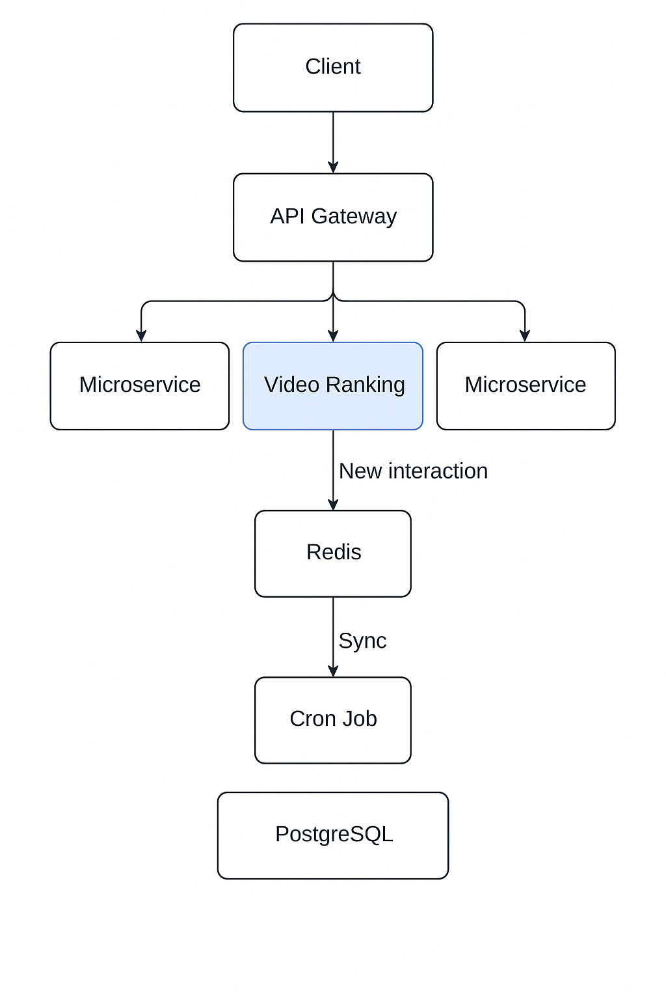

# Video Ranking Microservice

This project is a microservice designed to rank videos based on interactions such as views, likes, comments, shares, and watch time. The system supports both global ranking and personalized ranking for users and creators.

## Tech Stack
- Golang
- PostgreSQL
- Redis
- Gin
- Gorm
- Swagger (OpenAPI)
- Cron
- AWS EC2

## Features
- Real-time video score updates.
- Global video ranking.
- Personalized video ranking for each user or creator.
- API to retrieve ranked video lists.
- Swagger API Documentation (OpenAPI).

## Features Not Implemented
- Unit tests.

## Installation

1. Clone the repository:
    ```bash
    git clone https://github.com/LgThinh/video-ranking-microservice.git
    cd video-ranking-service
    ```

2. Install dependencies:
    ```bash
    go mod tidy
    ```

3. Download the `.env` file and place it at the same level as the `go.mod` file, or configure the variables in the config.go file:
   - `DB_HOST`, `DB_PORT`, `DB_USER`, `DB_PASSWORD`, `DB_NAME`
   - `REDIS_HOST`, `REDIS_PORT`

4. Run the service:
    ```bash
    go run main.go
    ```

5. Access Swagger at: [http://localhost:8080/api/v1/swagger/index.html#](http://localhost:8080/api/v1/swagger/index.html#)

## System Architecture Diagram

Here is the system architecture diagram illustrating how the microservice works:



## System Description

### Video Score Update Process
- Each time there is a new interaction (e.g., view, like, comment) on a video, the video score is updated in **real-time** in Redis.
- A cron job runs every minute to synchronize the scores into **PostgreSQL** for persistent storage.
- The video score is calculated based on various interaction factors (e.g., views, likes, comments, etc.), and each interaction contributes to a weighted score for the video.

### Entity Priority Score
- In addition to the video score, each **entity** (user or creator) has a **priority score** based on their interactions with videos from specific categories.
- For example, if an entity interacts frequently with videos in the **Sports** category, their priority score will increase for those types of videos.
- This priority score is used to personalize the video ranking for each entity, ensuring that videos are sorted by the entity’s preferences. This allows for a personalized ranking of videos based on the entity’s interaction history and interests.

### Global Ranking
- The global ranking lists videos based on their accumulated scores, which take into account interactions from all users and creators.

### Personalized Ranking
- In addition to global ranking, the system provides **personalized rankings** for each user or creator, factoring in their individual interaction history with the videos.
- This enables users to see the top videos that align with their preferences and interaction patterns.

---

## Contact
- Email: giathinh1112@gmail.com
- PhoneNumber: +84 961 319 096
- Github: https://github.com/LgThinh
